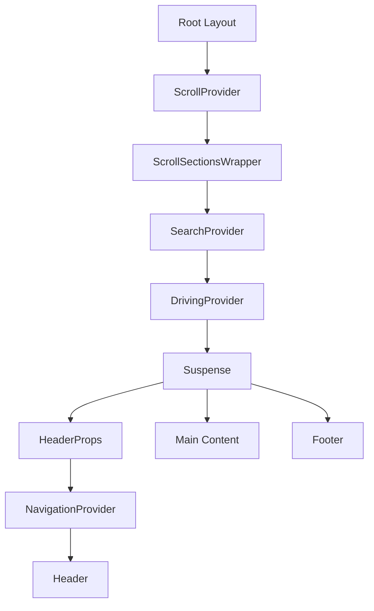

# Rapport technique — Système de navigation “Adaptable”

## Sommaire
1. [Périmètre et méthode](#périmètre-et-méthode)
2. [Cartographie des modules](#cartographie-des-modules)
3. [Schéma des Providers et montage](#schéma-des-providers-et-montage)
4. [Flows d’interaction détaillés](#flows-dinteraction-détaillés)
5. [Gestion des ancres/sections](#gestion-des-ancressections)
6. [Search et Slider : interactions et paramètres](#search-et-slider--interactions-et-paramètres)
7. [Effets de bord / Risques](#effets-de-bord--risques)
8. [Différences moteur Desktop vs Mobile](#différences-moteur-desktop-vs-mobile)
9. [Checklist de reproduction dans `src/features/desktop-nav`](#checklist-de-reproduction-dans-srcfeaturesdesktop-nav)

---

## Périmètre et méthode

- **Périmètre “Adaptable”** : Dossier `src/adaptable/src/` (utils, contexts, hooks, search, slider, composants UI), plus le montage Next dans `src/adaptable/app/`.【F:src/adaptable/app/layout.tsx†L1-L166】【F:src/adaptable/src/components/header/Header.tsx†L1-L92】
- **Périmètre application Next principale** : Dossier `app/` pour l’intégration actuelle des menus “features” et la présence d’ancres/sections dans les pages publiques.【F:app/layout.tsx†L1-L69】【F:src/components/00-Header/NavInterface.jsx†L1-L16】
- **Méthode** : Analyse statique des Contexts/Providers, Hooks, Utils, Routes, Composants UI, gestion hash/URL/scroll, resize, search, et slider. Les chemins et fonctions clés sont cités à chaque section.

---

## Cartographie des modules

### Contexts/Providers (Adaptable)

| Fichier | Rôle | Dépendances | Point d’entrée | 
| --- | --- | --- | --- |
| `src/adaptable/src/utils/context/NavigationContext.tsx` | État de navigation (route courante, sous-menu ouvert, showNavLinks) et `updateRoute` (router.push). | `next/navigation` | Utilisé par `Header`/`Nav`/`SubMenu`/`RenderLink`.【F:src/adaptable/src/utils/context/NavigationContext.tsx†L1-L85】 | 
| `src/adaptable/src/utils/context/ScrollContext.tsx` | État `activeSection` partagé pour activer menus et sections visibles. | React | Utilisé par `Header` et `useScrollAnchors`.【F:src/adaptable/src/utils/context/ScrollContext.tsx†L1-L40】 |
| `src/adaptable/src/utils/context/SearchContext.tsx` | Données de recherche (menuData enrichi + résultats + query). | `initializeMenuWithContent` | Utilisé par `NavInput` et page `search`.【F:src/adaptable/src/utils/context/SearchContext.tsx†L1-L62】 |
| `src/adaptable/src/utils/context/slider/SliderContext.tsx` | Contrôle slider (currentSlide, next/prev, classes). | `useSlides`, `useSlideRefParam`, `useScrollListener`, `useAutoSlide` | Utilisé par `Slider`.【F:src/adaptable/src/utils/context/slider/SliderContext.tsx†L1-L68】 |

### Hooks/Utils (Scroll/Nav)

| Fichier | Rôle | Dépendances | Point d’entrée |
| --- | --- | --- | --- |
| `src/adaptable/src/utils/scrollUtils.ts` | `useInitialScroll` (hash initial + reset), `useScrollAnchors` (listener scroll + update URL/sections). | `fnScrollUtils`, `updateMenuUtils` | Utilisé dans `Header` + `ScrollSectionsWrapper`.【F:src/adaptable/src/utils/scrollUtils.ts†L1-L36】 |
| `src/adaptable/src/utils/fnScrollUtils.ts` | `handleNavClick`, `handleScrollClick`, `scrollInView`, `addNewUrl` et `updateSectionClasses`. | DOM/History | Utilisé par `Header`, `Nav` (via `onNavigationClick`) et `useScrollAnchors`.【F:src/adaptable/src/utils/fnScrollUtils.ts†L1-L129】 |
| `src/adaptable/src/utils/updateMenuUtils.ts` | Mapping des classes “active”, gestion click outside/Escape, reset classes. | `NavigationContext` | Utilisé par `Header` et `Nav`.【F:src/adaptable/src/utils/updateMenuUtils.ts†L1-L128】 |
| `src/adaptable/src/utils/getSectionIds.ts` | Extraction IDs depuis `menuItems` et `AnchorId` (non utilisé). | `menuItems` types | Non branché dans les flows actuels.【F:src/adaptable/src/utils/getSectionIds.ts†L1-L26】 |

### Search

| Fichier | Rôle | Dépendances | Point d’entrée |
| --- | --- | --- | --- |
| `src/adaptable/src/utils/initializeMenu.ts` | Enrichit `menuItems` avec contenus par section. | `attachContentToMenu`, `contentIndex` | Utilisé par `SearchProvider`.【F:src/adaptable/src/utils/initializeMenu.ts†L1-L7】 |
| `src/adaptable/src/utils/searchMenu.js` | Parcours récursif des items pour produire résultats et chemins. | Données de menu | Utilisé par `useSearchHandler` et `SearchPageContent`.【F:src/adaptable/src/utils/searchMenu.js†L1-L103】 |
| `src/adaptable/src/components/header/navInput/useSearchHandler.tsx` | Gestion input, suggestions, submit, navigation vers `/search`. | `SearchContext`, `searchMenu` | Utilisé par `NavInput`.【F:src/adaptable/src/components/header/navInput/useSearchHandler.tsx†L1-L116】 |
| `src/adaptable/app/search/SearchPageContent.tsx` | Affichage résultats, navigation vers page cible, stockage `slideRef`. | `SearchContext`, `useSessionStorage` | Utilisé par route `/search`.【F:src/adaptable/app/search/SearchPageContent.tsx†L1-L114】 |

### UI et montage (Adaptable)

| Fichier | Rôle | Dépendances | Point d’entrée |
| --- | --- | --- | --- |
| `src/adaptable/app/layout.tsx` | Montage Providers (Scroll, Search, Driving) + Header/Footer. | `ScrollSectionsWrapper` | Layout global Adaptable.【F:src/adaptable/app/layout.tsx†L1-L166】 |
| `src/adaptable/app/headerProps.jsx` | Monte `NavigationProvider` autour de `Header`. | `Header` | Injecté dans `layout`.【F:src/adaptable/app/headerProps.jsx†L1-L18】 |
| `src/adaptable/app/ScrollSectionsWrapper.jsx` | Appelle `useScrollAnchors` avec `sections`. | `sections` | Monte le listener scroll global. 【F:src/adaptable/app/ScrollSectionsWrapper.jsx†L1-L12】 |
| `src/adaptable/src/components/header/Header.tsx` | Orchestration menu, resize, initial scroll, update classes. | `NavigationContext`, `ScrollContext`, `useResize` | Rendu par `HeaderProps`.【F:src/adaptable/src/components/header/Header.tsx†L1-L92】 |
| `src/adaptable/src/components/header/Nav.tsx` | Navigation principale, état d’ouverture, click outside/Escape, recherche. | `useMenuBehavior`, `NavigationContext` | Utilisé par `Header`.【F:src/adaptable/src/components/header/Nav.tsx†L1-L140】 |
| `src/adaptable/src/components/header/navLink/SubMenu.tsx` | Sous-menu ancre, click/keyboard, fermeture via context. | `NavigationContext` | Utilisé par `NavLinkShow`.【F:src/adaptable/src/components/header/navLink/SubMenu.tsx†L1-L80】 |

---

## Schéma des Providers et montage

### Montage Adaptable (Next “src/adaptable/app”)

- **ScrollProvider** est monté au niveau du layout global, et `ScrollSectionsWrapper` installe `useScrollAnchors` avec la liste `sections`.【F:src/adaptable/app/layout.tsx†L129-L166】【F:src/adaptable/app/ScrollSectionsWrapper.jsx†L1-L12】
- **NavigationProvider** est monté localement autour de `Header` via `HeaderProps`, ce qui limite la portée de l’état de navigation au header (important pour la reproduction).【F:src/adaptable/app/headerProps.jsx†L1-L18】
- **SearchProvider** est global (layout), ce qui rend la recherche disponible à la fois dans le header (input) et dans la page `/search`.【F:src/adaptable/app/layout.tsx†L129-L166】【F:src/adaptable/src/components/header/navInput/useSearchHandler.tsx†L1-L116】
- **Attention** : `ScrollSectionsWrapper` est aussi utilisé directement dans `src/adaptable/app/page.tsx`, ce qui peut dupliquer les listeners `scroll` si le wrapper est monté deux fois (risque).【F:src/adaptable/app/page.tsx†L1-L34】【F:src/adaptable/app/ScrollSectionsWrapper.jsx†L1-L12】

### Montage actuel dans l’app principale (`app/`)

- `NavInterface` monte les menus Desktop et Mobile “features” sans `SearchProvider` ni `ScrollSectionsWrapper` adaptables.【F:src/components/00-Header/NavInterface.jsx†L1-L16】
- `app/layout.tsx` place un `div.fixed-menu#top` mais ne monte aucun provider de navigation/scroll d’Adaptable, ce qui casse les conventions attendues par les utils Adaptable (hash, sections, activeSection).【F:app/layout.tsx†L57-L69】

---

## Flows d’interaction détaillés

### Chargement initial d’une page avec hash

1. `Header` appelle `useInitialScroll(pathname)` au montage et à chaque changement de route. 【F:src/adaptable/src/components/header/Header.tsx†L31-L33】
2. `useInitialScroll` : si `window.location.hash` existe, force `window.scrollTo({ top: 0 })` puis déclenche `handleScrollClick` avec l’ID du hash. 【F:src/adaptable/src/utils/scrollUtils.ts†L13-L20】
3. `handleScrollClick` anime le scroll via `requestAnimationFrame` sur 750 ms. 【F:src/adaptable/src/utils/fnScrollUtils.ts†L1-L33】
4. Après cela, `resetActiveMenuClasses` est appelé pour nettoyer les classes actives et les sous-menus ouverts (affichage). 【F:src/adaptable/src/utils/scrollUtils.ts†L18-L21】【F:src/adaptable/src/utils/updateMenuUtils.ts†L64-L88】

### Clic sur un item parent (ouvre sous-menu sans navigation)

1. `NavLinkShow` rend un `RenderLink` + `SubMenu` si `subItems` présents. 【F:src/adaptable/src/components/header/navLink/NavLinkShow.tsx†L34-L44】
2. Dans `RenderLink`, le clic sur un parent déclenche `onNavigationClick(menuItem.path + menuItem.AnchorId)` et `handleMenuClick(menuItem.id)` ; `handleMenuClick` togglise `openSubMenu` dans `Nav`. 【F:src/adaptable/src/components/header/navLink/RenderLink.tsx†L21-L52】【F:src/adaptable/src/components/header/Nav.tsx†L35-L46】
3. La navigation réelle est gérée par `handleNavClick` (via `handleNavigationClick` dans `Header`), qui peut décider de ne pas changer de route si la path est identique et sans hash. 【F:src/adaptable/src/components/header/Header.tsx†L48-L61】【F:src/adaptable/src/utils/fnScrollUtils.ts†L35-L79】
4. Le sous-menu visible dépend de `openSubMenu` et du rendu conditionnel dans `SubMenu` (`submenu open`).【F:src/adaptable/src/components/header/navLink/SubMenu.tsx†L36-L75】

### Clic sur un sous-item ancre (reset top → scroll → hash)

1. `SubMenu` calcule `fullPath = menuItem.path + subItem.AnchorId`. 【F:src/adaptable/src/components/header/navLink/SubMenu.tsx†L48-L55】
2. Sur clic, `handleSubItemClick` empêche la navigation native, appelle `onSubItemClick(fullPath)` et ferme le sous-menu (`setOpenSubMenu(null)`).【F:src/adaptable/src/components/header/navLink/SubMenu.tsx†L16-L28】
3. `handleNavClick` compare route courante vs target, puis appelle `updateRoute` et `handleScrollClick` selon les cas (même page vs page différente).【F:src/adaptable/src/utils/fnScrollUtils.ts†L35-L79】
4. `handleScrollClick` anime le scroll vers l’élément ancre. 【F:src/adaptable/src/utils/fnScrollUtils.ts†L16-L33】
5. Les classes actives de menu sont recalculées via `updateMenuClasses` (dans `Header`).【F:src/adaptable/src/components/header/Header.tsx†L63-L76】【F:src/adaptable/src/utils/updateMenuUtils.ts†L31-L60】

### Navigation vers une autre page avec ancre

1. `handleNavClick` détecte `currentPath !== targetPath` et appelle `updateRoute(targetPath)`. 【F:src/adaptable/src/utils/fnScrollUtils.ts†L63-L74】
2. Si un hash est présent, `updateRoute` est rappelé avec `${targetPath}#${targetHash}` (donc double push).【F:src/adaptable/src/utils/fnScrollUtils.ts†L63-L74】
3. `updateRoute` appelle `router.push` (Next App Router).【F:src/adaptable/src/utils/context/NavigationContext.tsx†L41-L59】
4. `useInitialScroll` se déclenche sur changement de route, force `scrollTo(0)`, puis `handleScrollClick` sur le hash de la nouvelle page. 【F:src/adaptable/src/utils/scrollUtils.ts†L13-L21】

### Scroll manuel (mise à jour activeSection, classes, URL hash)

1. `ScrollSectionsWrapper` appelle `useScrollAnchors(sections)` avec les ids statiques de `sections`.【F:src/adaptable/app/ScrollSectionsWrapper.jsx†L1-L12】【F:src/adaptable/src/assets/data/sections.ts†L1-L10】
2. Le hook installe un listener `scroll` qui :
   - Calcule `currentSectionId` via `scrollInView`. 【F:src/adaptable/src/utils/fnScrollUtils.ts†L91-L108】
   - Met à jour le hash via `history.replaceState` (`addNewUrl`).【F:src/adaptable/src/utils/fnScrollUtils.ts†L120-L128】
   - Met à jour les classes `.active-section` et l’état `activeSection`.【F:src/adaptable/src/utils/fnScrollUtils.ts†L109-L119】
3. `Header` recalculera les classes des menus en fonction de `activeSection`.【F:src/adaptable/src/components/header/Header.tsx†L63-L76】

### Click outside / Escape (fermeture sous-menus)

1. `useMenuBehavior` installe des listeners `mousedown` et `keydown`. 【F:src/adaptable/src/utils/updateMenuUtils.ts†L90-L125】
2. Si clic à l’extérieur de `navRef` → `setOpenSubMenu(null)` ; si `Escape` → fermeture. 【F:src/adaptable/src/utils/updateMenuUtils.ts†L90-L117】
3. `Nav` récupère `navRef` et l’associe à `nav.main-nav`.【F:src/adaptable/src/components/header/Nav.tsx†L29-L33】【F:src/adaptable/src/components/header/Nav.tsx†L74-L87】

### Resize (desktop/tablet/bigMenu/openButton/etc.)

1. `Header` gère `tabletMain`, `openMainButton`, `openButton`, `bigMenu`.【F:src/adaptable/src/components/header/Header.tsx†L35-L45】
2. `useResize` lit `window.innerWidth` et configure les flags selon seuils (1024, 1170, 1440).【F:src/adaptable/src/components/header/utils/useResize.ts†L8-L44】
3. `Nav` ajuste la visibilité des menus en fonction des flags (`openButton`, `openMainButton`, `bigMenu`) et des états internes `openMenu/lastClickedMenu`.【F:src/adaptable/src/components/header/Nav.tsx†L35-L114】

### Search (construction index/menuData, requête, clic résultat, navigation, params)

1. `SearchProvider` initialise `menuData` via `initializeMenuWithContent()` (menu + contenus).【F:src/adaptable/src/utils/context/SearchContext.tsx†L39-L46】【F:src/adaptable/src/utils/initializeMenu.ts†L1-L7】
2. `useSearchHandler` :
   - Sur input, `searchQuery(menuData, query)` et `filterSuggestions`.【F:src/adaptable/src/components/header/navInput/useSearchHandler.tsx†L24-L57】
   - Sur submit, pousse `/search?query=...` (ou `badKeyWord`) et `setResults`.【F:src/adaptable/src/components/header/navInput/useSearchHandler.tsx†L60-L86】
3. `SearchPageContent` lit `query`/`badKeyWord` via `useSearchParams`, met à jour `results` et `query` du contexte. 【F:src/adaptable/app/search/SearchPageContent.tsx†L15-L53】
4. Sur clic d’un résultat :
   - Si `result.go` existe, écrit `slideRef` en sessionStorage et navigue vers `result.path?slideRef=...`.【F:src/adaptable/app/search/SearchPageContent.tsx†L77-L104】
   - Sinon, navigation directe vers `result.path`.【F:src/adaptable/app/search/SearchPageContent.tsx†L101-L107】

### Slider (stop auto-slide au scroll, slideRef params)

1. `SliderProvider` compose les hooks : `useSlides`, `useSessionSlideRef`, `useSlideRefParam`, `useScrollListener`, `useAutoSlide`.【F:src/adaptable/src/utils/context/slider/SliderContext.tsx†L17-L47】
2. `useScrollListener` installe un listener scroll via `addScrollListener` et stoppe l’auto-slide si `scrollY > 5`.【F:src/adaptable/src/utils/context/slider/useScrollListener.ts†L1-L18】【F:src/adaptable/src/utils/addScrollListener.ts†L1-L14】
3. `useSlideRefParam` lit `slideRef` via `useURLParams.getParam` et force l’index du slider si trouvé.【F:src/adaptable/src/utils/context/slider/useSlideRefParam.ts†L10-L26】
4. `useSlides` met à jour le paramètre d’URL `slideRef` à chaque navigation next/prev. 【F:src/adaptable/src/utils/context/slider/useSlides.ts†L11-L50】

---

## Gestion des ancres/sections

### Détermination des IDs de sections

- **Liste statique** : `sections` contient `top`, `slider`, `about`, `services`, `contact`, `sans-permis`, `avec-permis`.【F:src/adaptable/src/assets/data/sections.ts†L1-L10】
- **Sections DOM réelles** :
  - Page d’accueil : sections `#slider`, `#about`, `#services`, `#contact`.【F:src/adaptable/app/page.tsx†L12-L31】
  - Layout : `<body id="top">` sert de cible pour `#top`.【F:src/adaptable/app/layout.tsx†L123-L140】
  - Page services : IDs générés via `servicesData` (`ref` = `sans-permis`, `avec-permis`).【F:src/adaptable/app/services/page.tsx†L40-L86】【F:src/adaptable/src/assets/data/servicesData.js†L1-L74】
- **Génération potentielle (non utilisée)** : `getSectionIds(menuItems)` extrait `AnchorId` depuis la data menu, mais n’est pas branché dans les hooks actuels. 【F:src/adaptable/src/utils/getSectionIds.ts†L1-L26】

### Où et comment `sections` est fourni

- `ScrollSectionsWrapper` appelle `useScrollAnchors(sections)` et est monté dans `layout` (global).【F:src/adaptable/app/ScrollSectionsWrapper.jsx†L1-L12】【F:src/adaptable/app/layout.tsx†L129-L166】
- La page d’accueil remonte un deuxième `ScrollSectionsWrapper` (double montage potentiel).【F:src/adaptable/app/page.tsx†L12-L34】

### Conventions d’ID et hash

- `menuItems` utilise `AnchorId` (ex: `#slider`, `#about`, `#sans-permis`).【F:src/adaptable/src/assets/data/menuItems.ts†L3-L105】
- Les sous-items sont construits via `menuItem.path + subItem.AnchorId`.【F:src/adaptable/src/components/header/navLink/SubMenu.tsx†L48-L55】
- `addNewUrl` remplace le hash dans l’URL à chaque scroll pour refléter la section active. 【F:src/adaptable/src/utils/fnScrollUtils.ts†L120-L128】
- `handleNavClick` utilise la valeur spéciale `scroll-start` quand la navigation reste sur la même page sans hash, mais aucun élément `#scroll-start` n’est présent (risque).【F:src/adaptable/src/utils/fnScrollUtils.ts†L99-L111】

---

## Search et Slider : interactions et paramètres

### Chaîne de données Search

- `SearchProvider` enrichit `menuItems` avec le contenu via `contentIndex`, ce qui permet de rechercher du texte associé aux sections (ex: slider, about).【F:src/adaptable/src/utils/context/SearchContext.tsx†L39-L46】【F:src/adaptable/src/assets/data/content/index.ts†L1-L12】
- `searchMenu` parcourt récursivement la structure, ignore certaines clés, et produit des résultats `path`, `text`, `go`, `slideRef`.【F:src/adaptable/src/utils/searchMenu.js†L1-L103】
- `useSearchHandler` s’appuie sur `filterSuggestions` pour proposer des mots clés issus du contenu, puis redirige vers `/search` avec query string. 【F:src/adaptable/src/components/header/navInput/useSearchHandler.tsx†L24-L86】【F:src/adaptable/src/utils/searchUtils.ts†L1-L26】

### Lien Search → Slider

- Sur la page `/search`, un résultat peut contenir `result.go` et `result.slideRef`. Si `result.go` est présent, `SearchPageContent` écrit `slideRef` en sessionStorage et pousse une URL avec `?slideRef=...`.【F:src/adaptable/app/search/SearchPageContent.tsx†L77-L104】【F:src/adaptable/src/utils/sessionStorage/useSessionStorage.tsx†L1-L20】
- Le Slider lit `slideRef` via `useURLParams.getParam` et via `sessionStorage` au montage. 【F:src/adaptable/src/utils/context/slider/useSlideRefParam.ts†L10-L26】【F:src/adaptable/src/utils/context/slider/useSessionSlideRef.ts†L6-L16】
- `useSlides` met à jour `slideRef` dans l’URL à chaque navigation du slider. 【F:src/adaptable/src/utils/context/slider/useSlides.ts†L11-L50】

---

## Effets de bord / Risques

- **Double `router.push` sur navigation avec hash** : `handleNavClick` fait `updateRoute(targetPath)` puis `updateRoute(targetPath#hash)` si hash différent, ce qui peut déclencher deux navigations successives. 【F:src/adaptable/src/utils/fnScrollUtils.ts†L63-L74】
- **Double montage de `ScrollSectionsWrapper`** : Le wrapper est monté dans le layout et dans la page d’accueil, entraînant potentiellement deux listeners `scroll` et des updates concurrentes. 【F:src/adaptable/app/layout.tsx†L129-L166】【F:src/adaptable/app/page.tsx†L12-L34】
- **`scroll-start` introuvable** : `handleNavClick` appelle `handleScrollClick('scroll-start')` sans qu’un élément `#scroll-start` n’existe, ce qui annule l’action. 【F:src/adaptable/src/utils/fnScrollUtils.ts†L99-L111】
- **Dépendances directes à `window`** : Plusieurs hooks/utilitaires manipulent `window` (scroll, history, matchMedia, sessionStorage) sans guard universel, ce qui rend le comportement dépendant du client. 【F:src/adaptable/src/utils/scrollUtils.ts†L13-L21】【F:src/adaptable/src/components/header/utils/useResize.ts†L8-L44】【F:src/adaptable/src/utils/context/slider/useSessionSlideRef.ts†L6-L16】
- **Listeners réinstallés** : `useMenuBehavior` dépend de `openSubMenu`, donc réinstalle les listeners `mousedown/keydown` à chaque changement d’état. 【F:src/adaptable/src/utils/updateMenuUtils.ts†L110-L125】
- **`showNavLinks` dans context non consommé** : `NavigationContext` expose `showNavLinks`, mais seule la setter est utilisée dans `Nav`. Cela indique un état potentiellement inutile ou obsolète. 【F:src/adaptable/src/utils/context/NavigationContext.tsx†L13-L18】【F:src/adaptable/src/components/header/Nav.tsx†L26-L33】

---

## Différences moteur Desktop vs Mobile

### Desktop Adaptable (référence “core”)

- **Scroll anchors** : Liste statique `sections` et listener direct `scroll` qui met à jour le hash via `history.replaceState`.【F:src/adaptable/app/ScrollSectionsWrapper.jsx†L1-L12】【F:src/adaptable/src/utils/scrollUtils.ts†L25-L36】
- **Navigation** : `NavigationProvider` local au `Header`, `handleNavClick`/`handleScrollClick` maison (sans offset).【F:src/adaptable/app/headerProps.jsx†L1-L18】【F:src/adaptable/src/utils/fnScrollUtils.ts†L35-L79】
- **Resize** : Gestion manuelle par `window.innerWidth` (seuils 1024/1170/1440).【F:src/adaptable/src/components/header/utils/useResize.ts†L8-L44】

### Desktop “features/desktop-nav” (implémentation actuelle)

- **Scroll anchors** : `useDesktopScrollAnchors([])` est appelé avec une liste vide, donc aucun mapping sections → activeSection → hash. 【F:src/features/desktop-nav/AdaptableDesktopNav.tsx†L35-L59】
- **Navigation** : `handleNavClick` et `handleScrollClick` sont dupliqués, mais l’écosystème de sections n’est pas branché. 【F:src/features/desktop-nav/core/utils/fnScrollUtils.ts†L35-L128】
- **Resize** : Utilise `matchMedia` et gère un flag `isDesktop` pour ne pas rendre le menu sous 1024px (diffère du core Adaptable).【F:src/features/desktop-nav/hooks/useResize.ts†L30-L88】
- **Search** : Input simplifié sans SearchProvider, sans suggestions, et sans navigation `/search?query`.【F:src/features/desktop-nav/AdaptableDesktopNavInput.tsx†L24-L74】

### Mobile “features/mobile-nav” (moteur distinct)

- **Scroll anchors** : Utilise un Web Worker `scrollWorker` + `rafThrottle`, et collecte dynamiquement les `section[id]` du DOM (pas de liste statique).【F:src/features/mobile-nav/core/hooks/useScrollAnchors.ts†L13-L77】
- **Scroll smooth** : Utilise un worker pour l’animation + gestion d’offset CSS `--scroll-offset`.【F:src/features/mobile-nav/core/utils/scrollSmooth.ts†L1-L84】
- **Navigation** : `NavigationContext` inclut `hamburgerMenuIsOpen` et le cycle d’ouverture/fermeture. 【F:src/features/mobile-nav/core/context/NavigationContext.tsx†L7-L72】
- **Initial scroll** : Pas de `resetActiveMenuClasses` après hash (différence par rapport à Adaptable).【F:src/features/mobile-nav/core/utils/scrollUtils.ts†L1-L13】

---

## Checklist de reproduction dans `src/features/desktop-nav`

> Objectif : Rebrancher le DesktopNav sur le comportement Adaptable Desktop “core”. Pas de code ici, uniquement les points de branchement.

### Providers indispensables (ordre recommandé)

- **ScrollProvider** (pour `activeSection`) au niveau du header Desktop. 【F:src/adaptable/src/utils/context/ScrollContext.tsx†L1-L40】
- **NavigationProvider** autour du header Desktop pour fournir `currentRoute`, `openSubMenu`, `updateRoute`.【F:src/adaptable/src/utils/context/NavigationContext.tsx†L1-L85】
- **SearchProvider** si l’input doit reproduire suggestions + navigation `/search` (sinon, le menu Desktop restera limité).【F:src/adaptable/src/utils/context/SearchContext.tsx†L1-L62】
- **ScrollSectionsWrapper** (ou un équivalent) pour fournir `sections` à `useScrollAnchors`.【F:src/adaptable/app/ScrollSectionsWrapper.jsx†L1-L12】

### Hooks/Utils indispensables

- **`useInitialScroll`** pour les pages avec hash (scroll vers l’ancre + reset des classes).【F:src/adaptable/src/utils/scrollUtils.ts†L13-L21】
- **`useScrollAnchors`** branché avec `sections` (liste réelle ou dynamique) afin d’alimenter `activeSection` et de mettre à jour le hash. 【F:src/adaptable/src/utils/scrollUtils.ts†L25-L36】
- **`handleNavClick` / `handleScrollClick`** pour reproduire le même comportement de navigation (incluant double `router.push`).【F:src/adaptable/src/utils/fnScrollUtils.ts†L35-L79】
- **`updateMenuClasses`** pour gérer les classes `active` des items et sous-items. 【F:src/adaptable/src/utils/updateMenuUtils.ts†L31-L60】
- **`useMenuBehavior`** pour les interactions click outside/Escape. 【F:src/adaptable/src/utils/updateMenuUtils.ts†L90-L125】

### Points de branchement dans `src/features/desktop-nav`

- **`AdaptableDesktopNav.tsx`** : Brancher `useInitialScroll` et `useScrollAnchors` avec les vraies sections ; intégrer `SearchProvider` si l’input doit reproduire la recherche Adaptable. 【F:src/features/desktop-nav/AdaptableDesktopNav.tsx†L1-L206】
- **`AdaptableDesktopNavInput.tsx`** : Remplacer l’input local par le flux `useSearchHandler` (query, suggestions, submit, reset).【F:src/features/desktop-nav/AdaptableDesktopNavInput.tsx†L1-L74】
- **`AdaptableDesktopNavItem.tsx`/`AdaptableDesktopSubMenu.tsx`** : Vérifier l’équivalence de `RenderLink`/`SubMenu` (navigation + fermeture + classes).【F:src/features/desktop-nav/AdaptableDesktopNavItem.tsx†L1-L118】【F:src/features/desktop-nav/AdaptableDesktopSubMenu.tsx†L1-L60】
- **`useResize` (desktop)** : Comparer les seuils/flags avec `useResize` Adaptable (les deux implémentations divergent).【F:src/features/desktop-nav/hooks/useResize.ts†L1-L88】【F:src/adaptable/src/components/header/utils/useResize.ts†L8-L44】

---

## Annexes (si besoin)

- Ce rapport fait moins de 800 lignes ; aucune annexe séparée n’est nécessaire.
